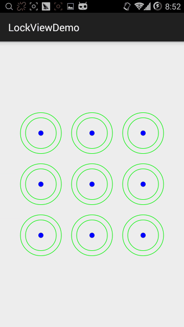
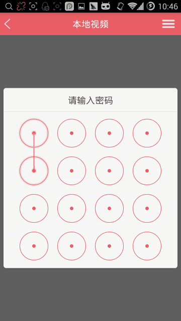

#Android-LockView
I code this for my another project and share it.
Originally wanted to find an open source control with a look, but did not search to the right. So write an unlock control.

if you have any question, please contact me.
E-mail: ZUImachao@163.com





##Gradle
```
compile 'com.mcourser:app:1.0.0'
```

##Usage:
```
    <com.mcourser.lockview.LockView
        android:layout_width="300dp"
        android:layout_height="300dp"/> 
```

```
    //set line color
    this.lockView.setColorLine(Color.RED);
		
    //set circle color
    this.lockView.setColorCircle(Color.GREEN);
		
    //set point color
    this.lockView.setColorPoint(Color.BLUE);
		
    //set column and row count
    this.lockView.setSpanCount(3);
		
    //set min point count to finish
    this.lockView.setMinPointCount(3);
		
    //set inner point circle radius
    this.lockView.setInnerCircleRadius(0.2F);
		
    //set inner trigger circle radius		
    this.lockView.setInnerTriggerCircleRadius(0.8F);
		
    //set outer circle radius
    this.lockView.setOuterCircleRadius(1.0F);
		
    //set set trigger circle show
    this.lockView.setTriggerCircleShow(true);
		
    //set listner
    this.lockView.setOnLockFinishListener(new OnLockFinishListener() {
        @Override
        public void onFinish(List<Integer> result) {
            //TODO
        }
    });
```